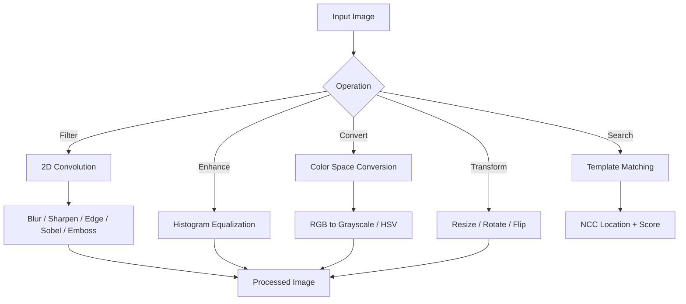
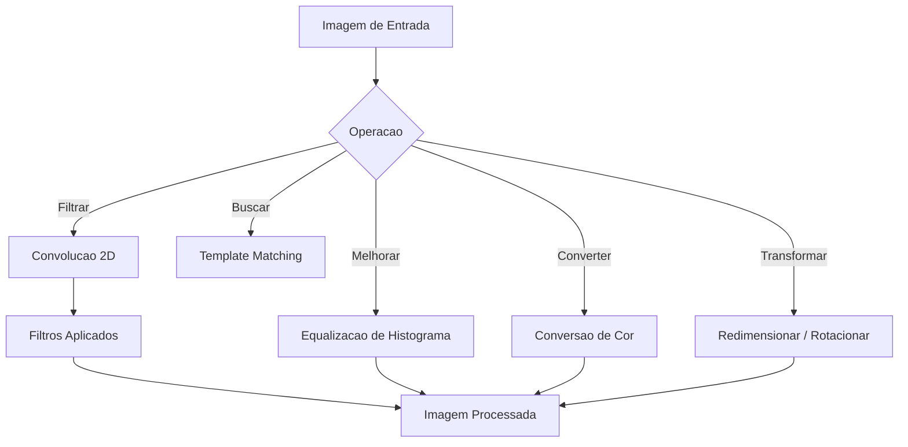

# Computer Vision Toolkit

<div align="center">


</div>

**[English](#english)** | **[Portugues (BR)](#portugues-br)**

---

## English

### Overview

A computer vision image processing toolkit built from scratch using NumPy. Implements 2D convolution with pre-defined kernels (blur, sharpen, edge detection, Sobel, emboss), histogram equalization, RGB/HSV/grayscale color space conversions, image resize, rotation, flip, and template matching via normalized cross-correlation.

### Architecture



### Features

- **Convolution Filters**: Blur, Gaussian blur, sharpen, edge detection, Sobel X/Y, emboss
- **Histogram**: Computation and equalization for contrast enhancement
- **Color Spaces**: RGB to grayscale (luminance), RGB to HSV
- **Transforms**: Nearest-neighbor resize, 90-degree rotation, horizontal/vertical flip
- **Template Matching**: Normalized cross-correlation search

### Usage

```python
from src.image_processing import ImageProcessor
import numpy as np

proc = ImageProcessor()
image = np.random.randint(0, 256, (100, 100, 3), dtype=np.uint8)

blurred = proc.apply_filter(image, "gaussian_blur")
edges = proc.apply_filter(image, "edge_detect")
gray = proc.rgb_to_grayscale(image)
equalized = proc.histogram_equalization(gray)
resized = proc.resize(image, 50, 50)
```

### Running Tests

```bash
pytest tests/ -v
```

### Author

**Gabriel Demetrios Lafis**
- [GitHub](https://github.com/galafis)
- [LinkedIn](https://www.linkedin.com/in/gabriel-demetrios-lafis-62197711b)

---

## Portugues BR

### Visao Geral

Um toolkit de processamento de imagens para visao computacional construido do zero usando NumPy. Implementa convolucao 2D com kernels pre-definidos (blur, sharpen, deteccao de bordas, Sobel, emboss), equalizacao de histograma, conversoes de espaco de cor RGB/HSV/escala de cinza, redimensionamento, rotacao, espelhamento e correspondencia de template via correlacao cruzada normalizada.

### Arquitetura



### Funcionalidades

- **Filtros de Convolucao**: Blur, blur gaussiano, nitidez, deteccao de bordas, Sobel, emboss
- **Histograma**: Computacao e equalizacao para melhoria de contraste
- **Espacos de Cor**: RGB para escala de cinza, RGB para HSV
- **Transformacoes**: Redimensionamento, rotacao 90 graus, espelhamento
- **Template Matching**: Busca por correlacao cruzada normalizada

### Executando os Testes

```bash
pytest tests/ -v
```

---

## License

MIT License - see [LICENSE](LICENSE) for details.
